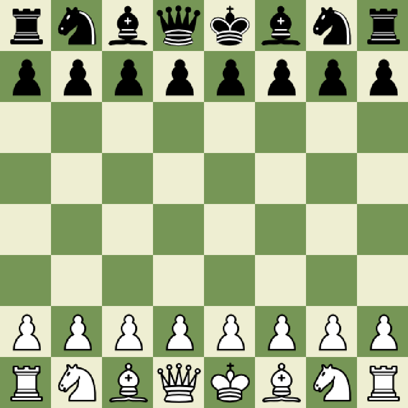
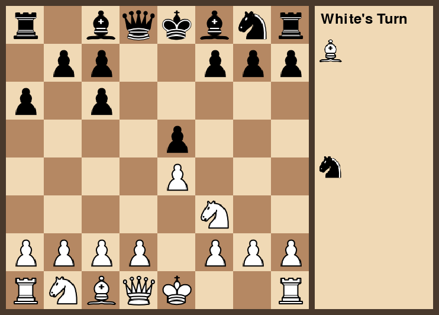

# Chess AI

A chess project in two parts:

1. **A chess engine written from scratch** — full move generation, castling, en
   passant, promotion and check/checkmate detection, with a Pygame board.
2. **A neural-network opponent** — a [Maia](https://maiachess.com) network
   (derived from [Leela Chess Zero](https://github.com/LeelaChessZero/lc0)) that
   selects *human-like* moves rather than engine-perfect ones, wired into a
   Pygame GUI on top of [python-chess](https://python-chess.readthedocs.io).

The goal was to first understand chess rules deeply by implementing them by
hand, then explore how a model can imitate human play.

## Features

- ♟️ **From-scratch engine** (`chess_ai.engine`) — legal move generation for all
  pieces, special moves (castling, en passant, promotion), check/checkmate and
  draw detection, FEN parsing, and drag-and-drop Pygame UI.
- 🧠 **Maia neural opponent** (`chess_ai.gui`) — encodes the position as a
  112-plane Leela-style tensor and picks moves from the network's policy head.
- 🛠️ **Data & training pipeline** (`chess_ai.data`, `chess_ai.ml`) — downloads
  player games from the Lichess API, encodes boards into tensors, and trains an
  experimental CNN to imitate a given player.

## Screenshots

| From-scratch engine (`chess-engine`) | Maia AI opponent (`chess-gui`) |
|:------------------------------------:|:------------------------------:|
|  |  |

## Project layout

```
chess-ai/
├── src/chess_ai/
│   ├── paths.py        # central, OS-independent resource paths
│   ├── engine/         # chess engine written from scratch (app.py)
│   ├── gui/            # Maia-powered GUI (game.py)
│   ├── ml/             # tensor encoding, Maia loader, CNN training
│   └── data/           # Lichess API client + data prep
├── third_party/maia/   # vendored Leela Chess Zero code (GPL-3.0)
├── models/             # *.h5 network weights
├── assets/             # piece sprites + background
└── docs/               # architecture & ML-pipeline notes
```

## Installation

The project uses [`uv`](https://docs.astral.sh/uv/) and targets **Python 3.11**
(the pinned TensorFlow 2.15 required by the Maia model supports 3.9–3.11; `uv`
provisions the right interpreter automatically).

```bash
# Lightweight install — enough to run the from-scratch engine
uv sync

# Full install — adds TensorFlow for the Maia neural opponent and CNN training
uv sync --extra ml
```

## Usage

```bash
# Chess engine written from scratch (Pygame, no AI)
uv run chess-engine

# Maia neural-network opponent (requires `uv sync --extra ml`)
uv run chess-gui

# Train the experimental CNN on a Lichess player's games
uv run python -m chess_ai.ml.model
```

> **GPU note:** the Maia network uses channels-first (`NCHW`) convolutions,
> which TensorFlow only runs on a CUDA-capable **GPU**, so `chess-gui` needs
> one for inference. The from-scratch `chess-engine` has no such requirement.

## How it works

- **[`docs/architecture.md`](docs/architecture.md)** — module map and how the
  two applications fit together.
- **[`docs/ml-pipeline.md`](docs/ml-pipeline.md)** — the data → tensor → model
  flow, the 112-plane board-encoding spec, and how the Maia policy head is used
  to choose a move.

## Tech stack

Python · [python-chess](https://python-chess.readthedocs.io) · Pygame ·
TensorFlow / Keras 2.15 · NumPy · scikit-learn · the Lichess API.

## License & attribution

This project is licensed under the **GNU General Public License v3.0** — see
[`LICENSE`](LICENSE).

It bundles GPL-3.0 code from **Leela Chess Zero** under
[`third_party/maia/`](third_party/maia/), and the Maia network weights are
derived from the LCZero pipeline. Because of this, the project as a whole is
distributed under the GPL-3.0. See [`NOTICE`](NOTICE) for full attribution.

## Acknowledgements

- [Leela Chess Zero](https://github.com/LeelaChessZero/lc0) for the policy-map
  code and training pipeline.
- [Maia Chess](https://maiachess.com) for the human-like network.
- [Lichess](https://lichess.org) for the open games API.
