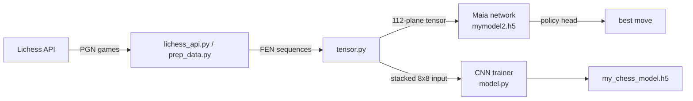

# ML pipeline

This document describes how positions become model inputs, how the Maia
network is used to pick a move, and the experimental training path.

## Overview

- **Acquisition** — `chess_ai.data.lichess_api` calls
  `https://lichess.org/api/games/user/<player>` and parses each game into a list
  of FEN positions. `prep_data.py` offers a similar download + PGN-parsing path.
- **Encoding** — `chess_ai.ml.tensor` turns positions into NumPy tensors.
- **Inference** — `chess_ai.gui.game` feeds the encoded board to the Maia
  network and reads a move from its policy head.
- **Training** — `chess_ai.ml.model` trains an experimental CNN to imitate a
  given player.

## Board encoding

### `ChessTensor` — one position, 12 planes

`ChessTensor.parse_fen` produces a `(12, 8, 8)` boolean tensor: one plane per
piece type and colour, in the order `PRNBQKprnbqk` (white pieces first, then
black). A square is `True` when it holds the corresponding piece.

### `generate_full_input_tensor` — Leela-style 112 planes

For Maia inference, `generate_full_input_tensor(board, history)` builds the
`(112, 8, 8)` integer tensor expected by an LCZero-style network:

| Planes | Meaning |
|--------|---------|
| `0–103` | 8 plies × 13 planes. Within each ply, planes `0–11` are the 12 piece planes (`PRNBQKprnbqk`); plane `12` is the LCZero repetition plane, left as zeros here. Ply 0 is the current position; ply *i* is the position *i* half-moves earlier (zeros when no such history exists). |
| `104` | White kingside castling right |
| `105` | White queenside castling right |
| `106` | Black kingside castling right |
| `107` | Black queenside castling right |
| `108` | Side to move (`1` if Black is to move) |
| `109` | Fifty-move-rule counter (kept at `0`) |
| `110` | Constant `0` |
| `111` | Constant `1` |

`chess_ai.ml.print_tensor.describe_and_print_tensor` prints each plane with a
human-readable label and is handy for debugging the encoding.

## Maia move selection (policy head)

`chess_ai.gui.game` chooses the AI move like this:

1. Enumerate the legal moves and look up each one's index in `policy_index` —
   the canonical list of 1858 UCI moves used by LCZero
   (`third_party/maia/tf2/policy_index.py`).
2. Encode the current board with `generate_full_input_tensor` and reshape it to
   `(1, 112, 64)`.
3. Run the network (`models/mymodel2.h5`, loaded with its custom
   `ApplySqueezeExcitation` / `ApplyPolicyMap` layers via
   `chess_ai.ml.maia_model.load_model`).
4. Index the policy output by the legal-move indices and select the move the
   network rates best.

The `ApplyPolicyMap` layer maps the raw `80×8×8` policy planes to the flat
1858-move vector using `lc0_az_policy_map.make_map()`.

## Experimental CNN trainer

`chess_ai.ml.model` is a separate, exploratory path: it downloads a player's
games, stacks several consecutive board states (via `ChessTensor`) into a
multi-channel `8×8` input, and trains a small Conv2D → Dense network to score
positions/moves (a step toward imitating that player). It is independent of the
Maia inference path above and saves its weights to `models/my_chess_model.h5`.
